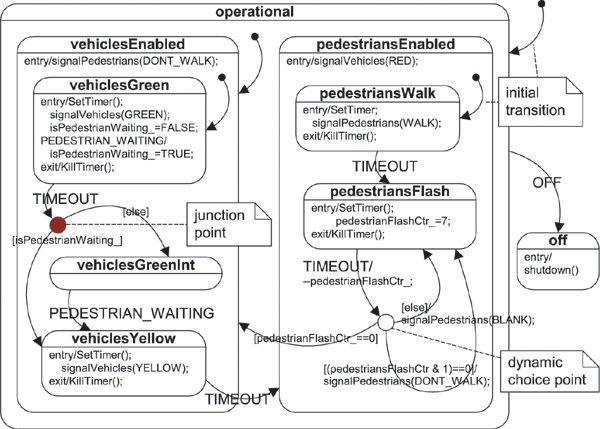
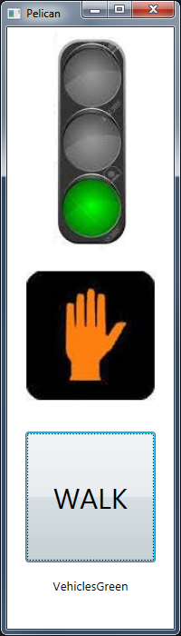

FSharp.HSM
==========

Hierarchical State Machine library in F#

Inspired by http://code.google.com/p/stateless/, http://accu.org/index.php/journals/252

Features:
- Hierarchical states
- Entry/Exit actions
- Guards
- Auto transitions
- Event handlers with optional transitions
- Output events for states and transitions
- Introspection of available events

Examples:

Phone call:

    [ configure OffHook
        |> on CallDialed Ringing
      configure Ringing
        |> on CallConnected Connected
        |> on HungUp OffHook
      configure Connected
        |> onEntry startTimer
        |> onExit stopTimer
        |> transitionTo InCall
        |> on HungUp OffHook
      configure InCall
        |> substateOf Connected
        |> on PlacedOnHold OnHold
      configure OnHold
        |> substateOf Connected
        |> onEntry startHoldMusic
        |> onExit endHoldMusic
        |> on TakenOffHold InCall ] 
    |> HSM.create

Pelican Signal HSM:

    [   configure State.Off
            |> onEntry shutdown
        configure Operational
            |> onEntry (fun () -> printfn "Operational %A" DateTime.Now)
            |> on Event.Off State.Off
            |> transitionTo VehiclesEnabled
        configure VehiclesEnabled
            |> substateOf Operational
            |> onEntry dontWalk
            |> transitionTo VehiclesGreen
        configure VehiclesGreen
            |> substateOf VehiclesEnabled
            |> onEntry (setTimer 10.)
            |> onEntry green
            |> handle PedestrianWaiting handleWaitingOnGreen
            |> handle Timeout handleTimeoutOnGreen
        configure VehiclesGreenInt
            |> substateOf VehiclesEnabled
            |> on PedestrianWaiting VehiclesYellow
        configure VehiclesYellow
            |> substateOf VehiclesEnabled
            |> onEntry (setTimer 4.)
            |> onEntry yellow
            |> on Timeout PedestriansEnabled
        configure PedestriansEnabled
            |> substateOf Operational
            |> transitionTo PedestriansWalk
            |> onEntry red
        configure PedestriansWalk
            |> substateOf PedestriansEnabled
            |> onEntry (setTimer 10.)
            |> onEntry walk
            |> onExit setFlashCount
            |> on Timeout PedestriansFlash
        configure PedestriansFlash
            |> substateOf PedestriansEnabled
            |> onEntry (setTimer 0.5)
            |> handle Timeout timeoutFlashing ]
    |> HSM.create

